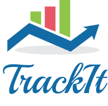

# TrackIt &middot;    

TrackIt is a straight forward, easy to use habit tracker!

## About it

You often forget your desired goal or fail to realize your accomplishment so far?

Stabilishing a new habit is already demanding, so a simpler tracker won't overload the activity while improving your perception of progress!

Try it:
  - Name an habit
  - Set the days
  - ***TrackIt***
  - Check your daily habits list
  - Review your monthly performance

## Built With
  

## How to run

Run the application at your local host, make a registration, login and start using it!

## Versioning

v1.0.0 - Launch
